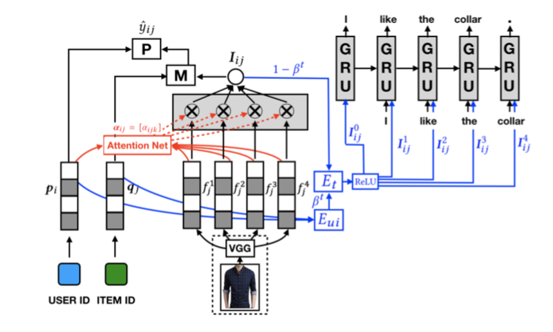

# Visually Explainable Collaborative Filtering 

## Requirements

- Python 2.7
- TensorFlow 1.8
- numpy 1.14

## Project Structure

    .
    ├── conf                    # Config files
    ├── data
        ├── categoried_data     # Experiment data   
    ├── results                 # Results saving
    ├── model          
        ├── our_model
            ├── VECFMain.py     # The main file of VECF
            ├── VECFModel.py    # The graph of VECF
            ├── FromMemory.py   # DataLoader          

## Parameter Settings

Example: 

data_type = 'Men/0' ######## need change ##########

batch_size = 256

global_dimension = 10

item_dimension = 10 # should be the same as global_dimension when using mul or add merging methods

hidden_dimension = 100

context_dimension = 50

word_embedding_dimension = 64

reg = 0.01

learning_rate = 0.01

optimization = 'Adam'

max_epoch = 15

K = 10

beta = 0.01
    

## Usage

1. Install all the required packages

2. Change the path to ./model/our_model/

3. Run VECFMain.py

## Author# VECF
